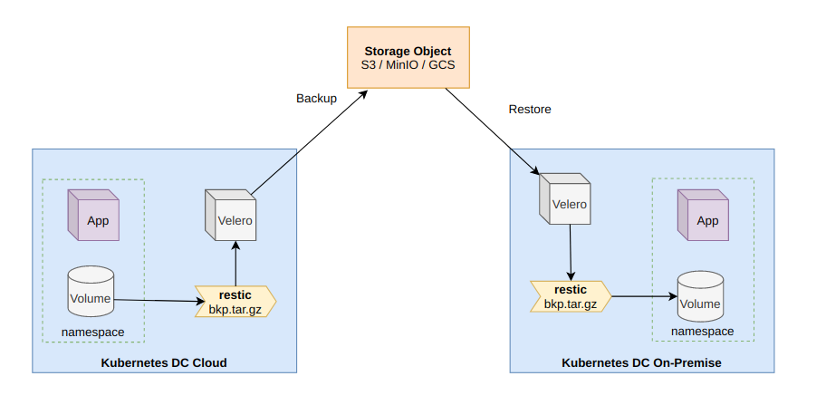

# Como instalar Velero en Openshift

## ¿Que es velero?


Con mucho de nuestros clientes abordamos estrategías de backups y restore integral sobre ambientes de contenedores como Openshift, no solo aspectos de backup y restore de la infraestructura y consideramos la infraestructura como la base de datos etcd, recreación de nodos, etc. Sino también todo lo que esté desarrollado con la aplicación sobre la plataforma de contenedores. 

Velero es una herramienta open source para realizar backups y restore, disaster recovery y migración de recursos de kuberntes incluído persistent volumes. Como el sitio oficinal del proyecto lo indica:

Velero utiliza un backend de storage object como S3, GCS o MinIO para poder alojar los backups. En nuestro caso para esta demo utilizaremos MinIO. Un tema importante a tener en cuenta es la necesidad de realizar un resguardo de volumenes persistentes donde tendremos que elegir la tecnología y escalarla acorde a nuestra necesidad sea on-premise o cloud. 

En nuestra demo consideramos escenarios tanto On-Premise como en ambientes de nube.

**- Ambiente Cloud**

En ambientes cloud como AWS, Openshit o Kubernetes pueden trabajar con backend de storage provisionando EBS para persistir datos asociados a nuestros pods. En este caso Velero utiliza trabaja sobre snapshots de EBS para hacer los backups. Toda solución de storage cloud que permita esta funcionalidad, trabaje con k8s y esté dentro de las cubiertas por velero, utilizarán este metodo para poder hacer backups y restores.

**- Ambiente On Premise**

En ambientes On Premise tenemos diversas alternativas segun el backend de storage que tengamos configurado en Openshift. Si trabajamos con vSphere y contamos con vSAN y nuestro cluster de kubernetes tiene configurado el plugin `vsphere-csi-driver`, podemos tomar snapshots de nuestros volúmenes. En cambio si tenemos el plugin `vsphere-volumes` que trabaja sobre un datastore, no podremos realizar snapshopts porque no lo permite. 

Sin snapshots, la opción que tenemos para trabajar es con `Restic`. Restic es una herramienta de backup open source que permite hacer una copia de los volumenes a un archivo y subirla a un backend de storage como MinIO/S3/GCS. La desventaja de restic para backups de volumenes de gran tamaño es que puede ser lenta al trabajar porque lo hace con un solo hilo de ejecución. Restic es habilitado al momento de la instalación por medio del argumento `--restic`.

Como verán, el sizing debe ser acorde al objetivo que se busca, para necesidades de mayor volumen de datos a persistir el sizing de MinIO es fundamental.

## Ambiente

La instalación de velero se realiza sobre un cluster previamente desplegado sobre cualquier infraestructurta Cloud y/o On-Premise.

* Infraestructura en AWS o vSphere.
* Openshift 4.x sobre AWS u On-Premise
* Host Bastión (Linux)

El rol del host bastión es poder ejecutar los comandos de instalación de velero y desplegar el backend de storage con MinIO como un contenedor agregando un volumen para la persistencia de datos. 

Un esquema de la demo es el siguiente, donde temos un cluster de Openshfit en AWS y un cluster de Openshift On-Premise.



## Instalación

Para el funcionamiento de velero es neceario tener el cliente de Openshift `oc` correctamente funcionando y acceso de cluster-admin para poder desplegar el software. 

Asumimos que el cliente oc esta instalado en el host bastión sino puede descargarlo de [aquí](https://mirror.openshift.com/pub/openshift-v4/clients/ocp/latest/openshift-client-linux.tar.gz)

### 1. Clonar repositorio

```
git clone https://github.com/vmware-tanzu/velero.git
cd velero
```

### 2. Instalar MinIO en Bastion

Configurar el directorio donde vamos a alojar la información de los s3.

```
sudo mkdir /minio/{data,config}
sudo chmod 755 -R /minio
```

Configuramos el firewall local. 

```
sudo firewall-cmd --get-active-zones
sudo firewall-cmd --zone=public --add-port=9000/tcp --permanent
```

Levantar minio como contenedor utilizando podman.

```
sudo podman run --name minio -p 9000:9000 \
  -v /minio/data:/data:z \
  -v /minio/config:/root/.minio:z \
  -e "MINIO_ACCESS_KEY=MINIOKEYMINIO" \
  -e "MINIO_SECRET_KEY=MINIOSECRETKEYMINIO" \
  minio/minio server /data
```

Datos de conexión para el bastión (ej: en laboratorio propio).

```
Bastion IP: 192.168.3.2
Bastion Hostname: minio.semperti.local
```

### 3. Instalar el cliente de MinIO

```
wget https://dl.min.io/client/mc/release/linux-amd64/mc
chmod +x mc
sudo cp mc /usr/local/bin/
mc --help
```

Configuramos el bucket de velero

```
mc alias set minio http://minio.semperti.local:9000 MINIOKEYMINIO MINIOSECRETKEYMINIO
mc alias ls
mc mb minio/velero
```

### 4. Instalación de Velero

```
wget https://github.com/vmware-tanzu/velero/releases/download/v1.4.2/velero-v1.4.2-linux-amd64.tar.gz
tar xvzf velero-v1.4.2-linux-amd64.tar.gz
sudo mv velero-v1.4.2-linux-amd64/velero /usr/local/bin/
velero version
```

### 5. Credenciales de Velero

Definimos las credenciales de velero para el host bastión, las password pueden ser cualquiera y simularían a un access key y access secrets de AWS.

```bash
cat << EOF > credentials-velero
[default]
aws_access_key_id = MINIOKEYMINIO
aws_secret_access_key = MINIOSECRETKEYMINIO
EOF
```

### 6. Instalacion de Velero

En la instalación de velero tenemos dos opciones: con o sin soporte de `restic`. `Restic` es una herramienta de backup nativa de linux y nos permite poder trabajar con volumenes persistentes, en este caso tenemos la opción de instalación con restic o sin el, solamente agregando el argumento `--restic`.

*ELEGIR SOLO UNA OPCION* 

* Sin restic y sin snapshots de volumenes.

```bash
velero install \
    --provider aws \
    --plugins velero/velero-plugin-for-aws:v1.0.0 \
    --bucket velero \
    --secret-file ./credentials-velero \
    --use-volume-snapshots=false \
    --backup-location-config region=minio,s3ForcePathStyle="true",s3Url=http://minio.mask.io:9000
```

* Sin restic y con snapshots de volumenes.

```bash
velero install \
    --provider aws \
    --plugins velero/velero-plugin-for-aws:v1.0.0 \
    --bucket velero \
    --secret-file ./credentials-velero \
    --use-volume-snapshots=true \
    --backup-location-config region=minio,s3ForcePathStyle="true",s3Url=http://minio.mask.io:9000
```

* Con restic y sin snapshots

```bash
velero install \
    --provider aws \
    --plugins velero/velero-plugin-for-aws:v1.0.0 \
    --bucket velero \
    --secret-file ./credentials-velero \
    --use-volume-snapshots=false \
    --use-restic \
    --backup-location-config region=minio,s3ForcePathStyle="true",s3Url=http://minio.mask.io:9000
```

*NOTA!!! Restic necesita acceder a los volúmenes asociados a los pods, es por esto que debemos otorgar premisos con privilegios.

```
oc adm policy add-scc-to-user privileged -z velero -n velero
```

En el caso de utilizar `restic` para versiones de Openshift u OKD 4.1+ debemos realizar el patch en el `DaemonSet` (ds) para que el pod con un `SecurityContextContrain` privilegiado.

```
# Patch ds para okd u ocp mayor 4.1
oc patch ds/restic \
  --namespace velero \
  --type json \
  -p '[{"op":"add","path":"/spec/template/spec/containers/0/securityContext","value": { "privileged": true}}]'
```

En caso que se desee que los pods de velero y restic corran en nodos dedicados podemos agregar el selector de nodo al namespace.

```
oc annotate namespace <velero namespace> openshift.io/node-selector=""
```

### 7. Test de aplicaciones

Primero creamos un proyecto de ejemplo con solo configmaps para testear el funcionamiento de manera rápida.

```
oc new-project test-velero-1
for i in $(seq 1 10); do oc create configmap cm-$i --from-literal="key=$i"; done
oc get configmap
```

Segundo vamos a desplegar una aplicación completa desde template efimero de Openshit.

```
oc new-project test-velero-2
oc new-app django-psql-example
```

Tercero vamos a desplegar una aplicación completa desde template con persistencia de datos.

```
oc new-project test-velero-3
oc new-app django-psql-persistent
```

### 8. Backup con Velero

Para realizar el backup con Velero solamente ejecutamos los siguientes comandos. 

NOTA: En ambientes de múltiple cluster donde tenemos un solo repositorio de velero es importante llamar a los backups con la nomenclatura correcta. 

```bash
BKP_DATE=$(date +'%Y%m%d-%H%M%S')
velero backup create aws-test-velero-1-$BKP_DATE --include-namespaces test-velero-1
velero backup create aws-test-velero-2-$BKP_DATE --include-namespaces test-velero-2
```

Para el caso de backups con AWS y usando snapshots

```
NAMESPACE=test-velero-3
velero backup create $CLUSTERID-$NAMESPACE-$BKP_DATE --include-namespaces $NAMESPACE --snapshot-volumes=true
```

### 9. Detalle de los backups

Si queremos ver los logs o el detalle de ejecutación

```
$ velero backup get
NAME                            STATUS      ERRORS   WARNINGS   CREATED                         EXPIRES   STORAGE LOCATION   SELECTOR
test-velero-1-20200904-183749   Completed   0        0          2020-09-04 18:37:51 +0000 UTC   29d       default            <none>
test-velero-2-20200904-183749   Completed   0        0          2020-09-04 18:38:09 +0000 UTC   29d       default            <none>
```

```
velero backup describe test-velero-1-$BKP_DATE
velero backup logs test-velero-2-$BKP_DATE
```

### 10. Simulamos un eleminación de datos.

Borramos los configmaps del proyecto test-velero-1

```
$ oc delete cm --all -n test-velero-1
configmap "cm-1" deleted
configmap "cm-10" deleted
configmap "cm-2" deleted
configmap "cm-3" deleted
configmap "cm-4" deleted
configmap "cm-5" deleted
configmap "cm-6" deleted
configmap "cm-7" deleted
configmap "cm-8" deleted
configmap "cm-9" deleted
$ oc get cm -n test-velero-1
No resources found in test-velero-1 namespace.
```

### 11. Restore con Velero

1. Restore con velero de objetos de Kubernetes

```
$ velero restore create --from-backup test-velero-1-$BKP_DATE
Restore request "test-velero-1-20200904-183749-20200904184145" submitted successfully.
Run `velero restore describe test-velero-1-20200904-183749-20200904184145` or `velero restore logs test-velero-1-20200904-183749-20200904184145` for more details.
```

Revisamos configmaps

```
$ oc get cm -n test-velero-1
NAME    DATA   AGE
cm-1    1      18s
cm-10   1      18s
cm-2    1      18s
cm-3    1      18s
cm-4    1      18s
cm-5    1      18s
cm-6    1      18s
cm-7    1      18s
cm-8    1      18s
cm-9    1      18s
```

2. Restore con velero de un proyecto completo.

Borramos el proyecto completo

```
$ oc get pods -n test-velero-2
NAME                           READY   STATUS      RESTARTS   AGE
django-psql-example-1-build    0/1     Completed   0          9m49s
django-psql-example-1-ckdwk    1/1     Running     0          7m46s
django-psql-example-1-deploy   0/1     Completed   0          7m49s
postgresql-1-deploy            0/1     Completed   0          9m49s
postgresql-1-gll9s             1/1     Running     0          9m47s
$ oc delete project test-velero-2
project.project.openshift.io "test-velero-2" deleted
$
```

Hacemos el restore completo.

```
velero restore create --from-backup test-velero-2-$BKP_DATE
```

```
$ velero restore describe test-velero-2-20200904-183749-20200904184316
Name:         test-velero-2-20200904-183749-20200904184316
Namespace:    velero
Labels:       <none>
Annotations:  <none>

Phase:  Completed

Backup:  test-velero-2-20200904-183749

Namespaces:
  Included:  all namespaces found in the backup
  Excluded:  <none>

Resources:
  Included:        *
  Excluded:        nodes, events, events.events.k8s.io, backups.velero.io, restores.velero.io, resticrepositories.velero.io
  Cluster-scoped:  auto

Namespace mappings:  <none>

Label selector:  <none>

Restore PVs:  auto
$ oc get pods -n test-velero-2
NAME                          READY   STATUS    RESTARTS   AGE
django-psql-example-1-build   1/1     Running   0          31s
django-psql-example-1-ckdwk   1/1     Running   0          64s
postgresql-1-gll9s            1/1     Running   0          64s
$
```

### 12. Backup AWS y Restore On-Premise

En caso de querer hacer un backup en la nube y un restore en On Premise es super simple, tenemos dos alternativas.

* **1. Backup MinIO en cloud y MinIO on premise**

Para esto debemos copiar el backup de un s3 a otro s3. Desde la cli de MinIO, hacemos lo siguiente. En MinIO On-Premise configurar el alias del minio de la nube.

```
$ mc alias ls | grep minio -A5 
minio
  URL       : http://minio.ocp4.labs.semperti.local:9000
  AccessKey : MINIOKEYMINIO
  SecretKey : MINIOSECRETKEYMINIO
  API       : s3v4
  Path      : auto

minio-aws
  URL       : http://minio-velero.apps.cluster-deb5.deb5.sandbox456.opentlc.com
  AccessKey : minio
  SecretKey : minio123
  API       : s3v4
  Path      : auto
```

Copiamos un backup de la nube a on-premise, donde `aws-test-velero-2-20200905-131513` es el nombre del backup en el s3 de la nube.

```
mc cp --recursive minio-aws/velero/backups/aws-test-velero-2-20200905-131513 minio/velero/backups/
mc ls minio/velero/backups/
```

Realizamos el restore previamente logueados al cluster On-Premise, como nuestro despliegue de velero On-Premise tiene configurado el repo de MinIO y nosotros hicimos el restore sobre ese mismo bucket, vamos a ver los backup de la nube previamente copiados. Solo resta realizar el restore en el cluster porque la fuente está en nuestro backend MinIO.

```
$ oc get backups -n velero
NAME                                AGE
aws-test-velero-1-20200905-131513   8m13s
aws-test-velero-2-20200905-131513   8m13s
```

```
velero restore create --from-backup aws-test-velero-1-20200905-131513
```

Chequeamos el restore
```
oc get cm -n test-velero-1
```

Si bien el sentido fue desde el cluster de AWS al cluster On-Premise, tranquilamente la misma operatoria puede darse en sentido contrario.

* **2. Minio central para velero de la nube como para on premise**

En este caso los backups que tomemos en la nube se verán en MinIO On Premise, es recomendable usar una nomenclatura a fin de distinguir cual es el origen de los backups, en nuestro caso utilizamos el prefijo `aws-velero-xxxx` para nombrar a los backups de AWS.

```
velero restore create --from-backup aws-test-velero-1-20200905-131513
```


### 13. Conclusiones y pasos a seguir.

Velero nos ofrece una opción rápida y simple para una estrategía de backup y retore nativa de Openshift/Kubernetes. Para ambientes de Cloud y/o ambientes OnPremise donde contemos con backend de storage de tipo Cloud, es una excelente opcion para reforzar la estrategia de backup, restore o migración de aplicaciones. Quedan por ver para proximas entradas los puntos relacionados con: 

1. Backups y Restore de Persistent Volumes con Snapshots
2. Backups y Restore de Persistent Volumes con Restic

En las commit subsiguientes vamos a extender en conceptos teóricos y prácticos.

### 14. Scripts de instalación en modo Shell Scripts

Los procedimientos son los mismos pero en este caso en formato shell scripts no mark down.

* [Instalación en Openshift con MinIO en Openshift](velero-install.sh)
* [Instalación en Openshfit con MinIO en host Bastión](velero-minio.sh)

## Links 

* [Velero.io](https://velero.io/docs/v1.4/basic-install/)
* [vsphere "Cloud Native Storage for vSphere", este plugins es necesario con vSAN para poder crear snapshots de volumenes.](https://blogs.vmware.com/virtualblocks/2019/08/14/introducing-cloud-native-storage-for-vsphere/)
* [Backup and Migrate TKGI (PKS) to TKG with Velero](https://beyondelastic.com/2020/04/30/backup-and-migrate-tkgi-pks-to-tkg-with-velero/)
* [Velero Plugin for vSphere](https://github.com/vmware-tanzu/velero-plugin-for-vsphere#installing-the-plugin)
* [Restic Integration](https://velero.io/docs/main/restic/)
